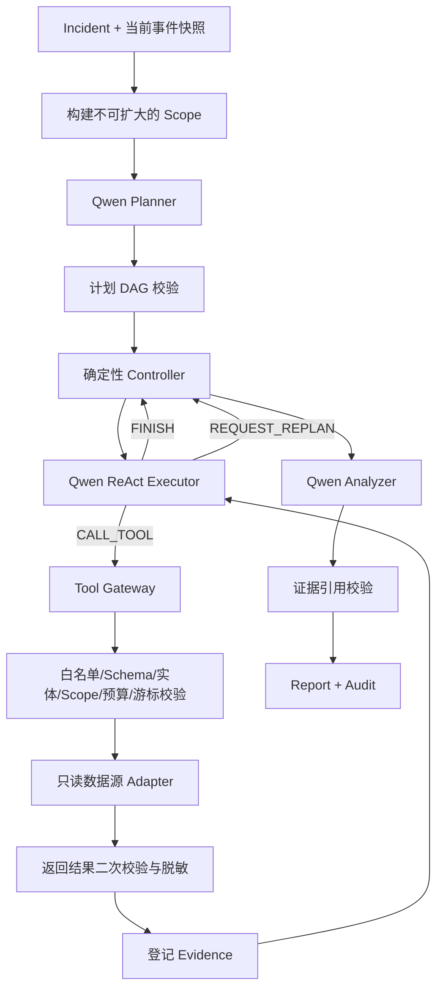

# AI Agent 自动调查架构

本文描述 Agent-Sec 中已经接入的 Go 版安全告警调查 Agent。它是现有确定性调查器的可选增强，
不会替代 eBPF 采集、行为规则和 Incident 关联，也不会在未配置模型时影响这些链路。

## 1. 设计目标

- 使用 Plan-and-Execute 生成整次调查计划，以 ReAct 逐个执行子任务；
- Planner、Executor、Analyzer 职责分离，可独立选择模型；
- 模型只选择只读工具，不直接访问数据库、不执行 Shell、不调用响应动作；
- Controller 用确定性代码约束工具白名单、参数、Scope、预算、分页和结束状态；
- 每项事实必须引用 Gateway 登记的 Evidence，模型输出不能成为原始证据；
- 每次阶段、动作、工具参数、工具结果和结束状态输出为单行 JSON 审计记录。

## 2. 总体流程



调用入口为 `POST /api/agent/investigate-ai`，请求体：

```json
{"incident_id":"inc-..."}
```

确定性调查仍使用 `POST /api/agent/investigate`。AI 调查必须显式调用，事件接收和规则流水线
不会隐式产生外部模型请求。

## 3. 模块职责

| 模块 | 职责 |
|---|---|
| `internal/agentdomain` | AI 调查使用的 Event、Entity、Scope、Evidence 等强类型契约 |
| `internal/agentllm` | Qwen HTTP 传输、JSON-only 响应、大小/超时限制和 429/5xx 有限重试 |
| `internal/agenttools` | 工具目录、参数 Schema、Gateway、签名游标、事件/上下文 Adapter |
| `internal/agentic/roles.go` | 独立 Planner、ReAct Executor、Analyzer 及中文提示词 |
| `internal/agentic/controller.go` | DAG 调度、步骤/调用预算、失败分级、确定性修复和报告校验 |
| `internal/agentic/runtime.go` | 将现有 `store.Memory` 快照映射为 Scope、实体和只读工具数据源 |
| `internal/agentaudit` | 终端和可选 JSONL 文件的单行审计日志 |
| `internal/app` | 可选装配 AI Runtime，并在未配置 API Key 时返回明确的 503 |

工具的完整目录和边界见 [`INVESTIGATION_TOOLS.md`](INVESTIGATION_TOOLS.md)。

## 4. 三个模型职责

### Planner

输入告警、Scope 和当前允许的工具公开 Schema；输出 1–8 个任务组成的 DAG。Planner 不能声称
工具已经执行。非法工具、重复任务 ID、未知依赖或环依赖会被代码拒绝，并降级为最小安全计划。

### ReAct Executor

每轮只能返回一种动作：

- `CALL_TOOL`：提供工具名、用途和参数；
- `FINISH`：提交当前任务的发现和缺口；
- `REQUEST_REPLAN`：说明为什么现有计划无法继续，并引用已有证据。

Executor 没有工具对象。Controller 收到动作后再通过 Gateway 执行；参数非法或重复无进展时，
Controller 只可在当前任务已批准工具中生成一次满足 Schema 的最小查询，且记录 `ACTION_REPAIRED`。

### Analyzer

只汇总 TaskResult 和 Evidence。`OBSERVED` 结论必须逐字对应 Evidence 的 `fact` 且引用其 ID；
报告引用不存在的证据时被拒绝并降级为 `INCONCLUSIVE`。空结果、数据源缺失和采集不完整都不能
被解释为“确认安全”。

## 5. 工具控制

工具集合按三层传递：

1. Runtime 只启用已经接入数据源的只读工具；
2. Planner 只能从 Runtime 的 `available_tools` 选择每个任务的 required/optional tools；
3. 执行某个任务时，Controller 只向 Executor 暴露该任务工具的 Schema，并由 Gateway 再校验。

当前接入：进程、文件、网络、DNS、权限、高危内核事件和遥测健康查询。登录用户、认证会话、
源 IP 归属、Web 请求、Kubernetes/云审计等契约已经设计，但在相应数据源 Adapter 完成前不会
提供给模型。仅靠 eBPF 无法可靠回答“哪个真实用户从哪个源 IP 登录”。

## 6. 失败和边界状态

| 状态 | 处理 |
|---|---|
| 未设置 `QWEN_API_KEY` | AI 接口返回 503；采集、规则、告警和确定性调查继续运行 |
| Qwen 429/5xx | 最多三次指数退避；请求超时和调用取消受 `context` 控制 |
| 模型 JSON/契约非法 | 不盲目接受；计划使用安全回退，动作尝试受约束修复，报告退化为保守结论 |
| 工具参数非法 | `REJECTED`，Adapter 不执行，参数与安全错误写入审计 |
| 工具越过 Scope | `DENIED`；若 Adapter 返回越界事件则 `RESULT_SCOPE_VIOLATION` |
| 数据源未接入 | 工具不暴露，或返回 `UNSUPPORTED`，不伪装成空结果 |
| 工具调用额度耗尽 | `LIMIT`，任务标记缺口，后继依赖任务可变为 `BLOCKED` |
| 遥测为空或不完整 | 报告保持 `INCONCLUSIVE/NEEDS_REVIEW` |
| 审计写入失败 | 调查停止，不允许形成不可审计的工具调用 |

## 7. 配置

```text
QWEN_API_KEY                 必填；只从进程环境读取
QWEN_PLANNER_MODEL           默认 qwen3.7-plus
QWEN_EXECUTOR_MODEL          默认 qwen3.7-plus
QWEN_ANALYZER_MODEL          默认 qwen3.7-plus
AI_MAX_DECISIONS             每任务最大模型决策数，默认 4
AI_MAX_TOOL_CALLS            整次调查最大工具调用数，默认 12
AI_AUDIT_LOG_PATH            可选 JSONL 审计文件；终端始终打印
```

API Key 不会进入模型输入、工具结果、审计日志或 HTTP 响应。

## 8. 当前限制

- AI 工具目前读取服务端内存快照，Server 重启后数据会丢失；
- 调查 Run 尚未写入 PostgreSQL，JSONL 只适合 MVP 审计；
- 当前是同步 HTTP 调查，生产环境应改为持久化 Job 和可恢复状态机；
- 当前 Adapter 只覆盖 eBPF RuntimeEvent，身份/会话/Web/K8s/云数据仍需独立接入；
- Agent 只读，不自动杀进程、隔离容器或封禁 IP；响应动作继续经过现有 Policy Guardrail。
