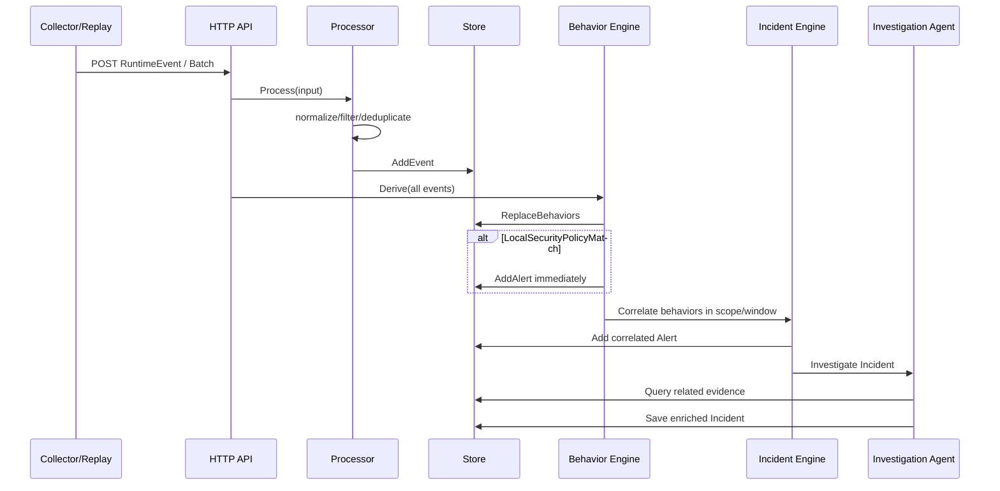

# Agent-Sec 项目架构

本文描述 Agent-Sec v0.5.0 MVP 的实际代码结构、运行链路、模块职责和当前边界。
更细的 eBPF ABI、Map、Ring Buffer 与过滤设计见
[`EBPF_RING_BUFFER_DESIGN.md`](EBPF_RING_BUFFER_DESIGN.md)。

## 1. 架构目标

项目围绕以下原则设计：

1. eBPF Sensor 只采集事实，不在内核中执行复杂安全判断；
2. 采集、检测和上报分别由 `CollectionPolicy`、`DetectionPolicy` 和 `UploadPolicy` 控制；
3. 高频事件优先在节点侧过滤、聚合或短期缓存，避免将系统变成全量日志平台；
4. 告警、行为和调查结论必须能够回溯到原始 `event_id`；
5. HTTP、CLI 和 UI 只调用应用层接口，不直接包含检测规则；
6. 当前实现保持模块边界清晰，为 PostgreSQL、OPA 和 LLM Adapter 预留替换点。

## 2. 总体架构

```mermaid
flowchart LR
    subgraph Node["Linux Node / Container Host"]
        Hooks["Kernel Tracepoints"] --> Sensor["CO-RE eBPF Sensor"]
        Maps["Filter Maps / Collection Level"] --> Sensor
        Sensor -->|"496-byte ABI Event"| Ring["BPF Ring Buffer"]
        Ring --> Source["Go LinuxSource"]
        Source --> Transform["Decode / Transform / Proc Enrichment"]
        Transform --> Detect["CEL DetectionPolicy + Go Fallback"]
        Detect --> Upload["UploadPolicy Router"]
        Upload --> High["ALWAYS / High-priority Batch"]
        Upload --> Buffer["ON_ALERT Rolling Buffer"]
        Upload --> Aggregate["AGGREGATE Window"]
        Upload --> Local["LOCAL_ONLY Summary"]
        Buffer -->|"Alert context promotion"| High
        Aggregate --> Normal["Normal-priority Batch"]
        High --> Sender["gzip HTTPSender"]
        Normal --> Sender
    end

    subgraph Server["Sentinel Go Server"]
        API["REST API / Static UI"] --> App["Application Service"]
        App --> Processor["Normalize / Filter / Deduplicate"]
        Processor --> Store["Memory Repository"]
        Store --> Behavior["Behavior Engine"]
        Behavior --> Alert["Direct Alert / B900"]
        Behavior --> Incident["Incident Correlation"]
        Incident --> Investigation["Deterministic Investigation Agent"]
        Investigation --> Graph["Runtime Graph / Timeline / Evidence"]
        Investigation --> Policy["Action Guardrail"]
        Alert --> Store
        Graph --> Store
    end

    Sender -->|"POST /api/events/batch"| API
    Replay["JSONL Replay CLI"] --> API
    API --> UI["Browser Investigation Console"]
```



节点和服务端之间只传输经过 `UploadPolicy` 允许的事件。当前 Collector 使用 HTTP；生产
版本需要替换为带节点身份认证的 mTLS 通道。

## 3. 核心数据链路

### 3.1 节点采集链路

```text
Tracepoint
  → Kernel filter Map
  → Ring Buffer reserve/submit
  → sensorabi.Decode
  → Transformer + /proc enrichment
  → DetectionPolicy
  → UploadPolicy
  → high/normal batch
  → POST /api/events/batch
```

当前 Sensor 采集：

- 进程 `fork`、`exec`、`exit`；
- 文件 `open/create`、`chmod`、`unlink`；
- IPv4/IPv6 outbound `connect`；
- PID/TGID/PPID、UID/GID、cgroup ID、进程启动时间等上下文。

`sys_enter_*` Hook 表示操作尝试，不代表系统调用最终成功。成功返回语义需要后续增加
enter/exit 关联。

### 3.2 节点三层策略

| 策略 | 执行位置 | 作用 |
|---|---|---|
| `CollectionPolicy` | eBPF Map/Hook | 控制哪些事实进入 Ring Buffer，降低内核到用户态的数据量 |
| `DetectionPolicy` | Go Collector | 使用 CEL 黑白名单和内置谓词完成本地安全判断 |
| `UploadPolicy` | Go Collector | 决定事件实时上传、缓存、聚合或仅本地保留 |

四种上报模式：

| 模式 | 处理方式 |
|---|---|
| `ALWAYS` | 高价值事件进入高优先级批次；本地 Alert 可同时回捞历史上下文 |
| `ON_ALERT` | 原始事件进入有界滚动缓存，命中 Alert 后按 scope 提升上传 |
| `AGGREGATE` | 相同 scope、进程和目标的事件在时间窗口内折叠为 Meta-Event |
| `LOCAL_ONLY` | 只在节点保留有界聚合摘要，默认不离开节点 |

### 3.3 服务端检测链路



服务端存在两条告警路径：

1. Collector 本地规则命中后，服务端派生 `B900 LocalSecurityPolicyMatch` 并直接生成 Alert；
2. B001、B003、B006、B008 在同一 Host/Container 和时间窗口内形成 Web RCE Incident，
   再生成关联 Alert 和调查结果。

## 4. 模块职责

### 4.1 可执行程序

| 模块 | 作用 | 主要输入/输出 |
|---|---|---|
| `cmd/server` | 装配 `app.Service`，启动 HTTP API 和静态 UI | 环境变量 → HTTP `:8080` |
| `cmd/collector` | Linux 节点 Agent 入口，加载 BPF、规则和过滤配置 | Ring Buffer → 批量 RuntimeEvent |
| `cmd/replay` | 将 JSONL 样本逐条发送给 Server，验证应用层检测链路 | JSONL → `/api/events` |

### 4.2 eBPF Sensor 与 ABI

| 路径 | 作用 |
|---|---|
| `sensor/ebpf/runtime.bpf.c` | 定义 Tracepoint 程序、内核过滤 Map、采集等级 Map、Ring Buffer 和统计计数 |
| `sensor/ebpf/runtime.h` | 定义内核与 Go 共享的固定宽度 ABI、事件类型和标志位 |
| `sensor/ebpf/Makefile` | 从内核 BTF 生成 `vmlinux.h`，使用 Clang 编译 CO-RE BPF 对象 |
| `internal/sensorabi` | 镜像 C ABI，校验 496 字节布局、ABI 版本、事件类型和网络地址 |

Sensor 内核 Map 的职责：

- `events`：8 MiB Ring Buffer；
- `exclude_pid/uid/cgroup`：高频可信实体降噪；
- `exclude_path_prefix`：原始路径前缀 LPM Trie，仅作为性能过滤；
- `collection_level`：按 cgroup 设置 NORMAL/WATCH/INVESTIGATION；
- `stats`：每 CPU 记录 emitted、filtered 和 reserve-failed。

### 4.3 Go Collector

| 文件/模块 | 作用 |
|---|---|
| `source_linux.go` | 加载 BPF 对象、重写 Agent PID、填充 Map、挂载 Tracepoint、读取 Ring Buffer |
| `transform.go` | 把 `RawEvent` 转换为嵌套 RuntimeEvent，生成稳定事件 ID 和进程实体 ID |
| `proc_linux.go` | 从 `/proc` 获取 Host/Boot 信息，并从 cgroup 文本推断容器 ID 和 Pod UID |
| `detection_cel.go` | 编译 CEL 黑白名单 Bundle；按优先级执行、限制求值成本、支持 `SIGHUP` 原子热更新 |
| `detection_policy.go` | 定义检测接口及 Go 内置兜底谓词，输出规则、严重级别和原因 |
| `upload_policy.go` | 将事件划分为 ALWAYS、ON_ALERT、AGGREGATE、LOCAL_ONLY |
| `upload_router.go` | 串联检测、分类、上下文回捞、post-alert 窗口和优先级路由 |
| `rolling_buffer.go` | 按 TTL、全局字节和单 scope 字节限制缓存 ON_ALERT/LOCAL_ONLY 数据 |
| `aggregator.go` | 按时间窗口和聚合 key 折叠高频事件，限制活跃 key 数量 |
| `runner.go` | 负责读取、转换、路由、双优先级批处理、定时 flush 和优雅关闭 |
| `sender.go` | 将批次发送到 Server；超过阈值时使用 gzip，并进行有限次数重试 |
| `metrics.go` | 输出 Collector、过滤、缓存、规则、上传和 Ring Buffer Prometheus 指标 |

CEL 规则位于 `configs/detection-rules.yaml`。黑名单优先于白名单；白名单只抑制本地检测，
不能绕过独立的上传和审计策略。

### 4.4 服务端应用层

| 模块 | 作用 |
|---|---|
| `internal/app` | 组合所有服务端组件；提供 Ingest、RunPipeline、Investigate 和 Summary 用例 |
| `internal/httpapi` | REST 路由、请求限制、gzip 解压、统一错误、CORS、安全响应头和静态文件服务 |
| `internal/processor` | 兼容扁平/嵌套事件格式，标准化、校验、去重、降噪和临时文件延迟关联 |
| `internal/model` | 定义 RuntimeEvent、Behavior、Alert、Incident、Graph、Policy 等领域对象 |
| `internal/store` | 当前线程安全内存 Repository，保存 Event、Behavior、Alert 和 Incident |

`app.Service` 是服务端唯一应用层入口。HTTP Handler、Replay 和测试通过它调用检测链路，
避免把业务规则散落到传输层。

### 4.5 行为、关联与图谱

| 模块 | 作用 |
|---|---|
| `internal/behavior` | 从事件派生 B001–B008 和 B900 共 9 类确定性 Behavior，并绑定 Evidence ID |
| `internal/incident` | 按 Host/Container 和时间窗口聚合 Behavior，形成 Web RCE Incident 与风险分 |
| `internal/graph` | 构建进程、文件、网络、容器和工作负载节点及其关系边 |
| `internal/collection` | 根据行为和 Incident 维护 NORMAL/WATCH/INVESTIGATION 服务端策略状态 |

`internal/collection` 当前只维护服务端内存状态；Server 到 Collector 的策略订阅和
`collection_level` Map 动态下发尚未实现。Collector 目前通过启动参数初始化 cgroup 等级。

### 4.6 调查与响应策略

| 模块 | 作用 |
|---|---|
| `internal/investigation` | 确定性查询进程、文件、网络和图谱证据，生成 Root Cause、Timeline、Attack Story、Blast Radius 和建议 |
| `internal/policy` | 对建议动作执行 allow、deny 或 require_approval Guardrail |
| `opa/policies/action.rego` | Go Policy Engine 的等价 Rego 策略，供后续 OPA Adapter 使用 |

当前 Investigation Agent 不调用外部 LLM；它生成结构化、证据绑定的调查结果，确保测试
可重复。后续接入 LLM 时，模型只能总结经过压缩的行为和证据，不能接收全量 syscall。

### 4.7 UI、样本和交付

| 路径 | 作用 |
|---|---|
| `public/` | 无构建依赖的调查控制台，由 Go Server 直接提供静态文件 |
| `datasets/web_rce.jsonl` | 完整 Web RCE 正样本，预期生成 Incident |
| `datasets/normal_ops.jsonl` | 未完成攻击链的负样本，不应生成 Incident |
| `Dockerfile` | Server 的多阶段构建镜像；不负责加载宿主机 eBPF |
| `docker-compose.yml` | 当前单 Server MVP 编排入口 |
| `Makefile` | 统一 test、build、sensor、run 和 replay 命令 |

## 5. 核心领域对象

```text
RuntimeEvent
  ├─ 原始事实与 Host/Process/Container 上下文
  └─ metadata 保存不同 Hook 的扩展字段

Behavior
  ├─ Subject / Object / Scope
  ├─ RiskScore
  └─ Evidence[] → RuntimeEvent.event_id

Alert
  ├─ Severity / Status / RuleIDs
  └─ EventIDs / CorrelationKey

Incident
  ├─ Behaviors / Evidence
  ├─ Runtime Graph / Timeline / Attack Story
  ├─ Root Cause / Blast Radius
  └─ Recommendations / Policy Decisions
```

稳定进程实体使用：

```text
proc://{host}/{boot_id}/{pid}/{process_start_time}
```

这避免只使用会复用的 PID 作为进程身份。

## 6. 接口边界

### 6.1 HTTP API

| 接口 | 调用方 | 作用 |
|---|---|---|
| `POST /api/events` | Replay/调试工具 | 接收单条事件并立即执行 Pipeline |
| `POST /api/events/batch` | Collector | 接收 gzip 或普通 JSON 批次 |
| `GET /api/events` | UI/调查工具 | 查询当前保存事件 |
| `GET /api/behaviors` | UI/调查工具 | 查询行为与证据引用 |
| `GET /api/alerts` | UI/调查工具 | 查询告警 |
| `GET /api/incidents` | UI/调查工具 | 查询 Incident 与调查结果 |
| `GET /api/incidents/{id}/graph` | UI | 查询 Incident 子图 |
| `POST /api/actions/evaluate` | UI/Agent | 评估响应动作是否允许 |
| `GET /metrics` | Prometheus | 获取 Server 指标 |

Collector 独立在 `127.0.0.1:9091/metrics` 暴露节点指标。

### 6.2 配置边界

- Server：通过 `HOST`、`PORT`、Body Limit、关联窗口和调查步数等环境变量配置；
- Collector：通过 CLI 参数配置 BPF 对象、服务端、缓存、聚合、规则和内核过滤；
- CEL：通过带版本的 YAML Bundle 配置，启动时完整编译，`SIGHUP` 热更新；
- eBPF ABI：C 和 Go 两侧版本、大小和字段顺序必须一致，只允许追加兼容变更。

## 7. 并发、资源与失败处理

- Ring Buffer 固定为 8 MiB，reserve 失败只增加计数，不阻塞内核；
- Runner 使用有界 channel，输入队列默认容量为 `batch-size × 4`；
- 高优先级和普通批次使用独立 flush 周期，高价值事件不会被普通聚合批次饿死；
- Rolling Buffer 同时受 TTL、全局字节和单 scope 字节上限约束；
- Aggregator 限制活跃 key 数，达到上限时输出最久未更新 bucket；
- HTTP Sender 有超时、重试和 gzip；目前没有磁盘 WAL 或 Server ACK 水位；
- Server Memory Store、Processor 和 Collection Manager 使用互斥锁保护进程内状态。

## 8. 部署形态

### 8.1 当前 MVP

```text
每个 Linux 节点：sentinel-collector + runtime.bpf.o
中心或单机服务：sentinel server + static UI
存储：Server 进程内 Memory Repository
```

### 8.2 目标演进

```text
Linux Nodes
  → mTLS Collector Gateway
  → PostgreSQL（Alert/Behavior/Incident/Rule/Policy）
  → ClickHouse（达到高事件规模后可选）
  → MinIO/S3（冷证据与调查包）
```

优先将 `store.Memory` 替换为 PostgreSQL Repository，且继续坚持只持久化高价值、聚合和
被 Alert 提升的事件，而不是将全部 eBPF 原始事件写入服务端。

## 9. 当前限制

1. 数据只保存在内存，Server 重启后 Event、Behavior、Alert 和 Incident 会丢失；
2. BPF 目前使用 syscall enter 语义，尚未区分操作成功和失败；
3. namespace、mount、privilege、ptrace、DNS 等 Hook 尚未实现；
4. `/proc` Enricher 只能推断容器 ID/Pod UID，尚未连接 CRI/Kubernetes API 获取完整元数据；
5. 服务端采集策略不能实时下发到 Collector；
6. Collector 到 Server 尚无 mTLS、节点身份和租户隔离；
7. Collector 断网后没有加密磁盘 spool；
8. Behavior Engine 当前基于内存全量事件重新计算，尚未实现乱序窗口和增量关联；
9. Investigation Agent 是确定性 MVP，实现了证据归纳但没有外部 AI Adapter。

## 10. 测试层次

| 层次 | 命令/数据 | 验证目标 |
|---|---|---|
| Go 单元测试 | `go test ./...` | ABI、转换、过滤、规则、缓存、聚合、API 和 Pipeline |
| 应用回放 | `./bin/replay -file datasets/web_rce.jsonl -reset` | Event → Behavior → Alert → Incident 完整链路 |
| eBPF 编译 | `make sensor` | BTF、Clang 和共享 ABI 可编译 |
| Linux 实机 | `sudo ./bin/sentinel-collector ...` | verifier、Tracepoint、Ring Buffer 和 HTTP 上报 |
| 负载测试 | 尚待补充 | Ring Buffer 丢失率、CPU、内存、网络和背压降级 |

