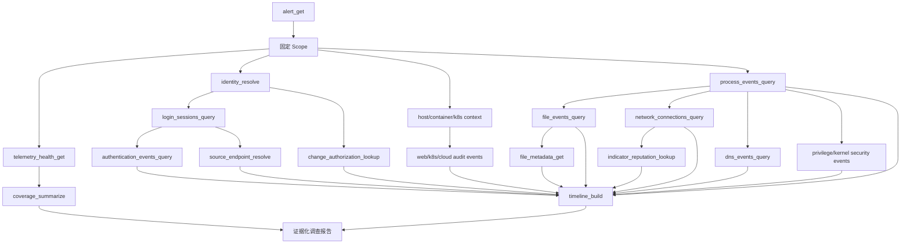

# 自动安全告警溯源工具设计

状态：工具契约目录。Go MVP 已接入进程、文件、网络、DNS、权限和高危内核事件查询，以及遥测健康查询；身份登录、Web、Kubernetes、云审计、信誉、变更授权和历史基线仍是扩展契约，未接入的数据源不会暴露给模型。

## 1. 目标与完成标准

工具层需要支持从一条告警出发，回答以下问题：

1. 告警是什么，种子事件是什么，调查范围是否明确？
2. 行为主体是谁：本地用户、域用户、云身份、Kubernetes ServiceAccount，还是无交互服务进程？
3. 用户何时登录、通过什么方式登录、会话是否成功、何时退出？
4. 登录或请求从哪里来：源 IP、源设备、VPN/NAT/代理映射和地理/网络区域是什么？
5. 在告警前后发生了哪些进程、文件、网络、DNS、权限和控制面事件？
6. 这些事件之间有哪些可验证关系，哪些只是推断？
7. 哪些数据源缺失、过滤、采样或超出保留期，结论是否完整？

“完整溯源”表示：在已批准的 Scope 和可用遥测内完成必要查询，并明确输出事实、推断、未知项和覆盖缺口。它不等于证明所有真实行为均已被采集，也不等于自动确认攻击成立。

没有用户登录的工作负载必须返回 `NOT_APPLICABLE`，例如由 systemd、容器入口进程或 Kubernetes ServiceAccount 启动的服务。数据源不可用时返回 `UNSUPPORTED` 或 `PARTIAL`，不能用空结果替代未知状态。

## 2. 工具设计原则

每个工具必须满足以下边界：

- 单一职责：一次调用只查询一种事实或完成一种确定性转换。
- 默认只读：不得执行 Shell、SQL、隔离主机、终止进程、删除文件或修改账号。
- Scope 强制注入：租户、主机、工作负载和时间范围由 Tool Gateway 注入，模型不能扩大。
- 实体必须已注册：工具只接受告警种子或先前工具返回的 `entity_ref`，不能接受任意对象名称作为可信实体。
- 参数类型固定：拒绝任意 SQL、查询语言、命令、脚本和未批准 URL。
- 查询与判定分离：工具返回事实和覆盖信息，不直接输出“已入侵”“C2”或“内部人员攻击”等最终结论。
- 来源可追踪：每条证据都包含来源、原始事件引用、时间和内容哈希。
- 空结果不等于安全：必须同时返回查询覆盖、遥测状态和截断状态。
- 分页和预算受控：所有列表工具使用服务端游标、固定页大小和调用额度。
- 敏感字段最小化：凭证、Token、Cookie、完整请求体和文件内容默认不进入模型上下文。

工具名采用 `<对象>_<动作>` 形式。`get` 返回单个已知对象，`query` 返回受限列表，`resolve` 做确定性身份映射，`lookup` 做外部上下文补充，`build/summarize` 只处理已登记证据。

## 3. 通用调用契约

### 3.1 Gateway 注入的 Scope

模型不能设置以下字段，由 Controller 和 Gateway 注入：

```json
{
  "run_id": "run-001",
  "scope_id": "scope-v1",
  "tenant_id": "tenant-a",
  "time_range": {
    "start": "2026-09-21T09:55:00Z",
    "end": "2026-09-21T10:02:00Z"
  },
  "allowed_hosts": ["host-ref-1"],
  "allowed_workloads": ["workload-ref-1"],
  "data_snapshot": "snapshot-001"
}
```

扩大时间范围、跨主机、跨容器、跨集群或跨租户不属于普通工具参数，必须提交单独的 Scope 扩展请求并经过授权。重新规划不会自动增加权限。

### 3.2 模型可提供的通用参数

```json
{
  "entity_ref": "已登记实体ID",
  "relation": "工具允许的关系枚举",
  "event_types": ["工具允许的事件枚举"],
  "limit": 50,
  "cursor": null
}
```

不是所有工具都接受全部字段。每个工具必须使用独立 Schema，并拒绝额外字段。

### 3.3 标准 ToolResult

```json
{
  "status": "OK",
  "query_id": "q-001",
  "tool": "login_sessions_query",
  "evidence_refs": ["ev-101"],
  "entity_refs": ["session-201", "identity-301", "ip-401"],
  "next_cursor": null,
  "coverage": {
    "query_complete": true,
    "truncated": false,
    "telemetry_status": "COMPLETE",
    "source": "linux-auth-log",
    "covered_start": "2026-09-21T09:55:00Z",
    "covered_end": "2026-09-21T10:02:00Z",
    "warnings": []
  },
  "error": null
}
```

`status` 只允许：

| 状态 | 含义 |
|---|---|
| `OK` | 查询成功并返回证据 |
| `EMPTY` | 查询完成但没有匹配记录；不能单独证明行为没有发生 |
| `PARTIAL` | 返回部分结果，同时存在截断、超时或部分数据源不可用 |
| `UNSUPPORTED` | 当前资产或数据源不支持该类查询 |
| `NOT_APPLICABLE` | 场景不适用，例如服务进程没有交互式登录会话 |
| `DENIED` | 请求超出 Scope、权限或任务白名单 |
| `ERROR` | 工具执行失败，结果不能视为完成查询 |

### 3.4 标准 Evidence

```json
{
  "evidence_id": "ev-101",
  "source_event_id": "auth-9988",
  "source": "linux-auth-log",
  "source_version": "snapshot-001",
  "observed_at": "2026-09-21T09:58:12Z",
  "ingested_at": "2026-09-21T09:58:14Z",
  "subject_refs": ["identity-301", "session-201"],
  "object_refs": ["host-ref-1", "ip-401"],
  "action": "LOGIN",
  "outcome": "SUCCESS",
  "fact": "用户 alice 于 09:58:12Z 通过 SSH 从 198.51.100.10 登录 host-01",
  "raw_ref": "archive://auth/9988",
  "source_hash": "sha256:..."
}
```

`fact` 是用于模型引用的脱敏事实；`raw_ref` 只供有权限的人工复核，不把原始敏感数据直接发送给模型。

## 4. 工具分类总览

| 分类 | 主要回答 | 核心工具 |
|---|---|---|
| 告警与范围 | 查什么、从哪里开始、数据是否可用 | `alert_get`、`telemetry_health_get` |
| 身份与登录 | 谁、何时登录、如何认证 | `identity_resolve`、`login_sessions_query`、`authentication_events_query` |
| 来源定位 | 源 IP 对应哪个设备、VPN/NAT/代理路径 | `source_endpoint_resolve` |
| 资产与工作负载 | 行为发生在哪台主机、容器、Pod | `host_context_get`、`container_context_get`、`k8s_workload_context_get` |
| 主机运行时 | 进程、文件、网络、DNS、提权和内核敏感行为 | `process_events_query`、`file_events_query`、`network_connections_query`、`dns_events_query`、`privilege_events_query`、`kernel_security_events_query` |
| 应用与控制面 | 哪个请求或控制面操作触发了运行时行为 | `web_access_events_query`、`k8s_audit_events_query`、`cloud_audit_events_query` |
| 外部上下文 | 指标信誉、文件属性、变更授权、历史基线 | `indicator_reputation_lookup`、`file_metadata_get`、`change_authorization_lookup`、`entity_baseline_get` |
| 确定性派生 | 排序时间线、校验关系、总结覆盖缺口 | `timeline_build`、`relationship_validate`、`coverage_summarize` |

## 5. 告警与范围工具

在实现工具前，建议先固定规范事件类型。各数据源的原始事件只能映射到下列已知枚举，未知类型保留为 `UNKNOWN`，不能由模型临时创造：

| 事件分类 | 规范事件类型 | 主要关联键 |
|---|---|---|
| 告警 | `ALERT_CREATED/ALERT_UPDATED` | alert_ref、seed_event_ref |
| 登录会话 | `SESSION_LOGIN/SESSION_LOGOUT/SESSION_TERMINATED` | session_ref、identity_ref、source_ip_ref、destination_ref |
| 认证 | `LOGIN_SUCCESS/LOGIN_FAILURE/MFA_CHALLENGE/TOKEN_ISSUE/KEY_AUTH/ACCOUNT_LOCK` | identity_ref、session_ref、source_ip_ref |
| 进程 | `PROCESS_FORK/PROCESS_EXEC/PROCESS_EXIT` | host boot ID、PID、start time、parent_ref、session_ref |
| 文件 | `FILE_CREATE/FILE_WRITE/FILE_RENAME/FILE_DELETE/FILE_CHMOD/FILE_CHOWN` | device、inode、file lifecycle、process_ref |
| 网络 | `NETWORK_CONNECT/NETWORK_ACCEPT/NETWORK_CLOSE` | flow/socket ref、process_ref、五元组 |
| DNS | `DNS_QUERY/DNS_RESPONSE` | transaction/ref、process_ref、domain_ref |
| 权限 | `SETUID/SETGID/CAPSET/SUDO/TOKEN_PRIVILEGE/CREDENTIAL_CHANGE` | process_ref、identity_ref、session_ref |
| 内核安全 | `SETNS/UNSHARE/MOUNT/UMOUNT/CHROOT/PIVOT_ROOT/PTRACE/BPF_LOAD/MODULE_LOAD` | process_ref、namespace/target ref |
| 容器生命周期 | `CONTAINER_START/CONTAINER_STOP/CONTAINER_EXEC` | container full ID、host_ref |
| Web入口 | `HTTP_REQUEST/HTTP_RESPONSE/WAF_DECISION` | request/trace ID、source_ip_ref、workload_ref |
| Kubernetes控制面 | `K8S_API_REQUEST` | audit ID、principal、object UID、source_ip_ref |
| 云控制面 | `CLOUD_API_REQUEST` | provider event ID、principal、resource_ref、source_ip_ref |
| 遥测健康 | `SENSOR_STATUS/DROPPED_EVENTS/UPLOAD_POLICY_CHANGE` | sensor_ref、host/workload ref、time range |

“查询全部事件”只能表示：对当前Scope、快照及已接入的上述类型完成分页查询。未接入的类型、内核过滤掉的事件、RingBuffer丢失事件和超出保留期的数据必须进入coverage缺口。

### 5.1 `alert_get`

- 职责：读取一条告警的原始字段、规则版本、种子事件引用和已有实体引用。
- 必需输入：`alert_ref`。
- 输出实体：alert、seed event、初始host/workload/process引用。
- 数据源：检测引擎或告警库。
- 禁止：不扩展调查范围，不查询关联事件，不判断告警是否误报。
- 完成条件：告警存在且租户匹配；种子缺失时明确返回 `PARTIAL`。

### 5.2 `telemetry_health_get`

- 职责：读取指定Scope内各数据源的采集、过滤、采样、丢失和保留状态。
- 必需输入：无模型参数，使用当前 `scope_id`。
- 输出：eBPF RingBuffer丢失数、Agent上传策略、日志延迟、保留期、各数据源覆盖时间。
- 数据源：Agent健康指标、采集配置、服务端接收指标。
- 禁止：不查询安全事件，不根据健康指标判断攻击。
- 完成条件：每个计划使用的数据源都有 `COMPLETE/DEGRADED/UNKNOWN/UNAVAILABLE` 状态。

## 6. 身份、登录与来源工具

### 6.1 `identity_resolve`

- 职责：把事件中的 UID、SID、账号名、云 principal、API key owner或ServiceAccount映射为规范身份实体。
- 必需输入：一个已登记的 `identity_hint_ref`。
- 可选关系：`current`、`historical_at_event_time`。
- 输出：identity_ref、身份类型、显示名、目录ID、账号状态、所属域/租户；敏感属性脱敏。
- 数据源：本机账号库、AD/LDAP、IdP、云IAM、Kubernetes对象缓存。
- 禁止：不查询登录记录，不推断实际操作者，不返回密码、Token或密钥材料。
- 边界说明：ServiceAccount只能说明工作负载身份，不能自动映射为某个自然人。

### 6.2 `login_sessions_query`

- 职责：查询身份或主机在Scope时间内的登录会话边界。
- 必需输入：`identity_ref`或`host_ref`，二选一。
- 可选参数：`session_types`=`SSH/RDP/CONSOLE/VPN/WEB_SSO/CLOUD_CONSOLE`、游标。
- 输出：session_ref、login_at、logout_at、session_type、source_ip_ref、destination_ref、认证结果、会话ID。
- 数据源：Linux auth/journald、Windows Logon、VPN、IdP/SSO、云控制台登录日志。
- 禁止：不返回会话内执行的命令，不把失败登录当作成功会话，不根据用户名猜测同一人。
- 完成条件：覆盖告警前后的Scope窗口；无法关联会话时返回 `EMPTY` 并保留遥测状态。

### 6.3 `authentication_events_query`

- 职责：查询认证尝试和认证方式，补充登录成功前后的失败、MFA和凭证类型信息。
- 必需输入：`identity_ref`、`session_ref`或`source_ip_ref`之一。
- 事件枚举：`LOGIN_SUCCESS`、`LOGIN_FAILURE`、`MFA_CHALLENGE`、`TOKEN_ISSUE`、`KEY_AUTH`、`ACCOUNT_LOCK`。
- 输出：事件时间、认证方式、结果、原因码、身份和源IP引用。
- 数据源：PAM/SSHD、Windows Security、IdP、VPN、云IAM。
- 禁止：不输出凭证内容，不创建登录会话，不把大量失败直接标为暴力破解。

### 6.4 `source_endpoint_resolve`

- 职责：在事件发生时间点，把 `source_ip_ref` 解析为来源设备、网络区域及经过的VPN/NAT/代理映射。
- 必需输入：`source_ip_ref`和`observed_at`。
- 输出：endpoint_ref、IP、主机名、设备所有者引用、网段/区域、VPN session、NAT前后地址、代理链、映射置信度。
- 数据源：DHCP、DNS资产记录、EDR资产表、VPN、NAT、防火墙、反向代理和负载均衡日志。
- 禁止：不做IP信誉判断，不把公网IP直接等同于具体人员，不在缺少时间点映射时使用当前资产归属替代历史归属。
- 完成条件：返回确定映射、多个候选及冲突，或明确 `UNKNOWN`。

## 7. 资产与工作负载上下文工具

### 7.1 `host_context_get`

- 职责：读取告警时刻主机的规范身份和安全上下文。
- 必需输入：`host_ref`。
- 输出：host_id、boot_id、操作系统、环境、业务归属、关键性、Agent版本、时钟状态。
- 禁止：不查询主机事件，不执行实时命令，不返回整份CMDB记录。

### 7.2 `container_context_get`

- 职责：把容器ID映射为镜像、运行时、宿主机和生命周期信息。
- 必需输入：`container_ref`。
- 输出：容器完整ID、镜像digest、启动/停止时间、runtime、host_ref、namespace/cgroup引用。
- 禁止：不读取容器文件，不执行 `docker exec`，不把可变镜像标签当作唯一身份。

### 7.3 `k8s_workload_context_get`

- 职责：把container/Pod引用映射为集群、Namespace、Pod、工作负载、ServiceAccount和镜像部署信息。
- 必需输入：`container_ref`或`pod_ref`。
- 输出：cluster_ref、namespace、pod UID、owner workload、service_account_ref、node_ref、image digest、deployment revision。
- 禁止：不查询Kubernetes审计事件，不修改集群对象，不仅凭Pod名称跨生命周期关联。

## 8. 主机与容器运行时工具

### 8.1 `process_events_query`

- 职责：查询进程创建、执行、退出及父子关系。
- 必需输入：`process_ref`、`session_ref`或Scope根实体。
- 关系：`self`、`parents`、`children`、`session_members`、`tree`。
- 输出：process_ref、host boot ID、PID、start time、parent_ref、可执行文件、参数的脱敏摘要、用户/session引用、结果。
- 数据源：eBPF、auditd、EDR、容器运行时。
- 禁止：不读取进程内存，不执行命令，不以PID作为跨重启唯一标识。

### 8.2 `file_events_query`

- 职责：查询文件创建、写入、重命名、删除、权限/所有者变化。
- 必需输入：`process_ref`或`file_ref`。
- 事件枚举：`CREATE/WRITE/RENAME/DELETE/CHMOD/CHOWN`。
- 输出：file_ref、device/inode/lifecycle、脱敏路径、actor process、动作、结果、可用哈希。
- 数据源：eBPF LSM/VFS、auditd、EDR。
- 禁止：不读取完整文件内容，不自动上传文件，不仅凭路径认定为同一文件。

### 8.3 `network_connections_query`

- 职责：查询进程发起或接受的网络连接。
- 必需输入：`process_ref`、`ip_ref`或Scope根实体。
- 事件枚举：`CONNECT/ACCEPT/CLOSE`。
- 输出：socket/flow引用、源/目标IP和端口、协议、process_ref、开始/结束时间、结果、字节统计（若可用）。
- 数据源：eBPF socket hooks、conntrack、EDR、流日志。
- 禁止：不做DNS归属或IP信誉查询，不把443端口直接解释为HTTPS或C2。

### 8.4 `dns_events_query`

- 职责：查询进程或主机的DNS请求和响应。
- 必需输入：`process_ref`、`host_ref`或`domain_ref`。
- 输出：query name/type、response、resolver、rcode、process_ref、缓存/采集标记。
- 数据源：eBPF DNS解析、系统解析器日志、DNS服务器日志。
- 禁止：不把解析结果自动等同于后续连接，不做域名信誉判定。

### 8.5 `privilege_events_query`

- 职责：查询用户、进程的权限和安全上下文变化。
- 必需输入：`process_ref`、`identity_ref`或Scope根实体。
- 事件枚举：`SETUID/SETGID/CAPSET/SUDO/TOKEN_PRIVILEGE/CREDENTIAL_CHANGE`。
- 输出：actor、旧/新身份或能力、目标、结果和关联session。
- 数据源：eBPF、auditd、Windows Security、sudo日志。
- 禁止：不把所有sudo行为判为提权攻击，不修改权限。

### 8.6 `kernel_security_events_query`

- 职责：查询少量高价值内核安全状态变化。
- 必需输入：`process_ref`或Scope根实体。
- 事件枚举：`SETNS/UNSHARE/MOUNT/UMOUNT/CHROOT/PIVOT_ROOT/PTRACE/BPF_LOAD/MODULE_LOAD`。
- 输出：actor process、目标namespace/process/path、参数摘要、结果。
- 数据源：eBPF tracepoint/LSM、auditd。
- 禁止：不采集高频read/write/send/recv，不代替文件和网络工具，不自动认定容器逃逸。

## 9. 应用入口与控制面工具

### 9.1 `web_access_events_query`

- 职责：查询触发服务进程行为的HTTP入口请求。
- 必需输入：`workload_ref`、`request_ref`或`source_ip_ref`。
- 输出：request_ref、时间、源IP、代理链、方法、脱敏路由、状态码、认证身份引用、trace/request ID。
- 数据源：Ingress、WAF、API Gateway、反向代理和应用访问日志。
- 禁止：默认不返回Cookie、Authorization、完整查询串或请求体；不直接判定漏洞利用。

### 9.2 `k8s_audit_events_query`

- 职责：查询Kubernetes API对象访问和变更。
- 必需输入：`workload_ref`、`service_account_ref`、`identity_ref`或对象引用。
- 输出：verb、resource、namespace、object ref、user/service account、source IP、response code、audit ID。
- 数据源：Kubernetes Audit Log。
- 禁止：不读取Secret内容，不修改对象，不把ServiceAccount自动映射为自然人。

### 9.3 `cloud_audit_events_query`

- 职责：查询云控制面API活动。
- 必需输入：`cloud_resource_ref`、`identity_ref`或`source_ip_ref`。
- 输出：provider event ID、API action、principal、source IP、resource refs、result、request correlation ID。
- 数据源：云审计日志。
- 禁止：不调用变更API，不跨账号查询，不返回访问密钥内容。

## 10. 外部上下文与授权工具

### 10.1 `indicator_reputation_lookup`

- 职责：查询一个已观察到的IP、域名或文件哈希的外部信誉上下文。
- 必需输入：一个 `indicator_ref`。
- 输出：供应商、查询时间、分类、置信度、首次/最近观察时间和原始引用。
- 禁止：不接受模型随意生成的指标，不上传文件内容，不把单一供应商结果升级为最终攻击结论。

### 10.2 `file_metadata_get`

- 职责：读取已登记文件的哈希、签名、包归属和首次观察信息。
- 必需输入：`file_ref`。
- 输出：大小、哈希、签名状态、软件包/镜像层归属、首次/最近观察时间。
- 禁止：不读取完整内容，不执行样本，不代替信誉查询。

### 10.3 `change_authorization_lookup`

- 职责：查询告警时间内与资产、用户或工作负载相关的变更单和运维授权。
- 必需输入：`host_ref`、`workload_ref`或`identity_ref`。
- 输出：ticket ref、批准状态、执行窗口、批准人引用、授权动作摘要。
- 禁止：不根据相似描述自动认定当前行为已授权，不修改工单。

### 10.4 `entity_baseline_get`

- 职责：读取主体在历史窗口内已经计算完成的行为基线。
- 必需输入：一个identity/process image/workload/destination实体引用及基线类型。
- 输出：观察窗口、频率、常见关系、基线版本和数据覆盖。
- 禁止：不现场扫描无限历史，不把“以前出现过”解释为安全，不让模型自由指定无界窗口。

## 11. 确定性派生工具

这些工具不访问新的原始数据，只处理Evidence Store中已经登记的证据。通常由Controller调用，不直接暴露给模型。

### 11.1 `timeline_build`

- 职责：按事件时间排序已登记证据，并保留同时间事件和时钟不确定性。
- 输入：`evidence_refs`。
- 输出：标准化时间线项、来源时间和摄取时间。
- 禁止：不创造缺失事件，不把时间相邻自动变成因果关系。

### 11.2 `relationship_validate`

- 职责：验证指定关系是否被证据字段支持。
- 输入：subject_ref、predicate枚举、object_ref、evidence_refs。
- 输出：`SUPPORTED/CONTRADICTED/UNKNOWN`及支持/反对证据。
- 允许关系：父子进程、会话到进程、进程到文件、进程到连接、容器到Pod、登录到源IP。
- 禁止：不接受自由文本谓词，不做开放式威胁推理。

### 11.3 `coverage_summarize`

- 职责：汇总本次使用的数据源、查询完成度、时间覆盖和缺口。
- 输入：本Run的ToolResult引用。
- 输出：每类问题的 `COMPLETE/PARTIAL/UNKNOWN/NOT_APPLICABLE`。
- 禁止：不把所有query完成解释为遥测完整，不隐藏错误或降级。

## 12. 单一告警的推荐执行链



建议执行顺序：

1. 读取告警、种子和遥测健康，先确定能查什么。
2. 并行解析身份与资产/工作负载，不依赖模型猜测用户名或Pod归属。
3. 有身份时查询登录会话和认证事件；无交互身份则标记 `NOT_APPLICABLE`。
4. 根据登录会话中的源IP，在事件时间点解析来源设备、VPN/NAT/代理链。
5. 从种子进程展开父子进程，再查询关联文件、连接、DNS、权限和内核高价值事件。
6. 根据告警类型补充Web入口、Kubernetes或云控制面事件。
7. 只对真实取得的指标做信誉查询，并查询文件属性、变更授权和历史基线。
8. 用确定性工具构建时间线、校验明确关系、总结覆盖缺口。
9. Analyzer只基于已登记证据生成结论；所有推断保留证据引用和不确定性。

## 13. 最终报告必须包含的字段

```json
{
  "alert": {},
  "scope": {},
  "subjects": [
    {
      "identity_ref": "identity-301",
      "identity_type": "HUMAN",
      "display_name": "alice",
      "resolution_status": "RESOLVED"
    }
  ],
  "login_sessions": [
    {
      "session_ref": "session-201",
      "login_at": "2026-09-21T09:58:12Z",
      "logout_at": null,
      "method": "SSH_KEY",
      "source_ip": "198.51.100.10",
      "source_endpoint_ref": "endpoint-401",
      "status": "SUCCESS"
    }
  ],
  "assets_and_workloads": [],
  "timeline": [],
  "behavior_summary": {
    "processes": [],
    "files": [],
    "network_connections": [],
    "dns": [],
    "privilege_changes": [],
    "control_plane_events": []
  },
  "findings": [],
  "alternative_explanations": [],
  "missing_evidence": [],
  "coverage": {},
  "review_required": true
}
```

“用户、登录时间、来源和源IP”不能只出现在自由文本摘要中，必须放在结构化字段里并带Evidence ID。如果无法确认，字段保留并使用 `UNKNOWN/NOT_APPLICABLE`，同时说明缺少的数据源。

## 14. 实施优先级

| 优先级 | 工具 | 原因 |
|---|---|---|
| P0 | `alert_get`、`telemetry_health_get` | 确定调查起点和结论边界 |
| P0 | `identity_resolve`、`login_sessions_query`、`source_endpoint_resolve` | 回答谁、何时、从哪里来 |
| P0 | host/container/Kubernetes上下文 | 建立资产和工作负载身份 |
| P0 | process/file/network/DNS/privilege查询 | 还原主要运行时行为 |
| P0 | `timeline_build`、`coverage_summarize` | 形成可审计时间线和缺口 |
| P1 | authentication、kernel security、Web/Kubernetes/cloud audit | 补齐入口、认证和高危状态变化 |
| P1 | file metadata、change authorization | 区分落地载荷与授权运维 |
| P2 | reputation、baseline | 提供辅助上下文，不能替代本地证据 |

推荐先把P0工具做成稳定、可分页、可审计的窄接口，再增加P1/P2。不要把所有数据源封装成一个 `search_everything` 工具；这种接口难以授权、难以验证覆盖，也会让模型生成任意查询。

## 15. 当前 MVP 对照

| 目标工具 | 当前实现 | 缺口 |
|---|---|---|
| `process_events_query` | `process_events` | 只有合成快照和简化进程ID，缺少session/user/boot_id/start_time |
| `file_events_query` | `file_events` | 只有create/write/chmod，缺少inode、hash、rename/delete/chown |
| `network_connections_query` | `network_events` | 只有connect，缺少accept/close、流量统计和NAT信息 |
| 其他工具 | 未实现 | 需要接入认证日志、资产、Kubernetes、云审计、DNS、工单等数据源 |

当前默认计划只能完整查询进程、文件、网络三个类别，不能回答真实环境中的“哪个用户何时从哪个源IP登录”。在身份、会话和来源工具实现并加入计划完成条件之前，最终报告必须把这些问题标为缺失证据。

## 16. 验收用例

每个工具至少验证：正常结果、空结果、分页、超时、数据源不可用、Scope越权、未知实体、敏感字段脱敏、源数据被改写、游标复用、遥测部分缺失和审计写入失败。

端到端单告警验收必须覆盖：

- 人类用户通过SSH/VPN登录，能够关联登录时间、源IP、来源设备、会话进程和后续文件/网络行为。
- Web入口触发容器进程，不存在交互登录用户，能够关联request、Pod、ServiceAccount和运行时行为。
- 云或Kubernetes控制面变更，能够关联principal、source IP、API事件和受影响资源。
- NAT/VPN映射缺失时，报告来源为UNKNOWN而不是猜测。
- RingBuffer丢事件或日志超出保留期时，coverage为PARTIAL，空查询不能产生“未发生攻击”的结论。
- 同名账号、PID复用、Pod重建和文件路径复用时，使用带生命周期的实体ID避免错误关联。
